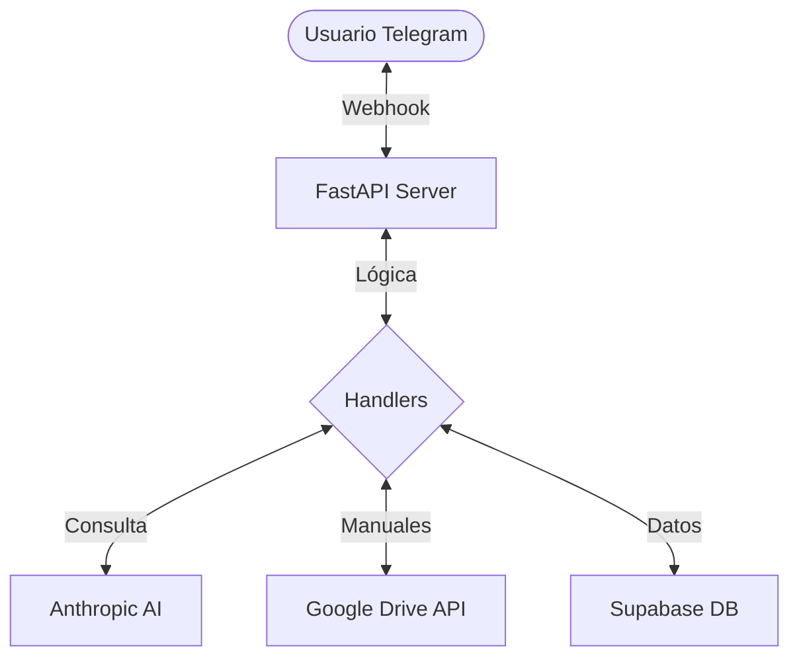

# 🤖 Nexos Chatbot TecniExpress

Chatbot inteligente para Telegram diseñado para la gestión y consulta de manuales técnicos en PDF, integrando inteligencia artificial de última generación y almacenamiento en la nube.


---

## 🚀 Características Principales

- **Lectura de Manuales PDF**: Integración directa con Google Drive para procesar y responder preguntas basadas en manuales técnicos.
- **Inteligencia Artificial**: Potenciado por **Anthropic Claude** para respuestas precisas y naturales.
- **Base de Datos Robusta**: Uso de **Supabase** para la persistencia de datos y gestión de sesiones.
- **Infraestructura Moderna**: Despliegue simplificado mediante Docker y Docker Compose.
- **Hot-Reload**: Entorno de desarrollo optimizado con recarga en tiempo real.

---

## 🛠️ Stack Tecnológico

| Tecnología | Propósito |
| :--- | :--- |
| **FastAPI** | Framework web para el Webhook y API. |
| **Anthropic Claude** | Motor de IA para procesamiento de lenguaje natural. |
| **Google Drive API** | Acceso y lectura de manuales técnicos en PDF. |
| **Supabase** | Backend as a Service para base de datos PostgreSQL. |
| **Docker** | Contenerización y reproductibilidad. |
| **PyMuPDF** | Procesamiento y extracción de texto de archivos PDF. |

---

## 🏗️ Arquitectura del Sistema



---

## ⚙️ Configuración e Instalación

### Requisitos Previos
- [Docker](https://www.docker.com/) y [Docker Compose](https://docs.docker.com/compose/) instalados.
- Token de Bot de Telegram (vía [@BotFather](https://t.me/botfather)).
- Credenciales de Google Cloud Service Account.

### Instalación Local

1. **Clonar el repositorio:**
   ```bash
   git clone https://github.com/israelsalinas-g/nexos-chatbot-tecniexpress.git
   cd nexos-chatbot-tecniexpress
   ```

2. **Configurar variables de entorno:**
   Copia el archivo de ejemplo y rellena tus datos:
   ```bash
   cp .env.example .env
   ```
   > [!IMPORTANT]
   > Asegúrate de que `GOOGLE_SERVICE_ACCOUNT_JSON` esté en una sola línea en tu archivo `.env`.

3. **Levantar con Docker:**
   ```bash
   docker compose up --build
   ```

---

## 🐳 Comandos Útiles de Docker

- **Iniciar en segundo plano:** `docker compose up -d`
- **Ver logs:** `docker compose logs -f`
- **Detener:** `docker compose down`
- **Reconstruir imagen:** `docker compose build --no-cache`

---

## 👨‍💻 Desarrollador
**Israel Salinas**  
Partner: *Antigravity AI (Senior Solution Architect)*

---

## 📄 Licencia
Este proyecto es de uso privado para Nexos TecniExpress.
