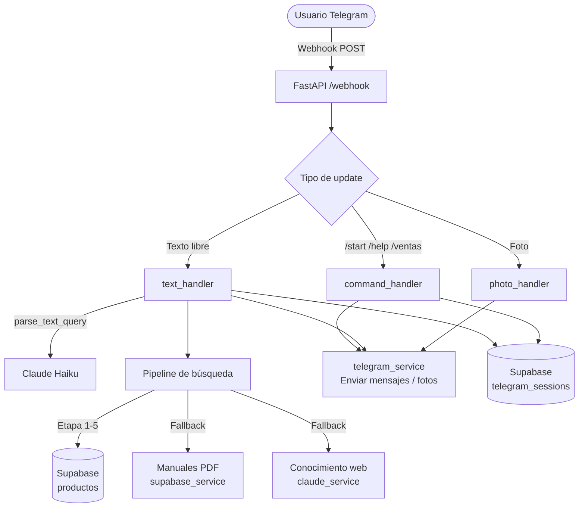

# Nexos Chatbot TecniExpress

Chatbot de Telegram para consulta de repuestos de electrodomésticos. Los usuarios describen el repuesto en lenguaje natural y el bot lo busca en el catálogo de Supabase, con fallback a manuales PDF y al conocimiento técnico de Claude.


---

## Características

- **Búsqueda multicriterio**: pipeline de 5 etapas (código exacto → palabras → FTS → compatibilidad de modelo → ILIKE).
- **NLP con Claude**: interpreta consultas en lenguaje natural para extraer marca, modelo y repuesto.
- **Fotos de producto**: envía imagen + ficha técnica por cada resultado.
- **Sesiones conversacionales**: recuerda el contexto del usuario durante 30 minutos (TTL configurable).
- **Escalación a ventas**: comando `/ventas` con enlace directo al equipo de atención.
- **Fallback en capas**: BD → Manuales PDF → Conocimiento técnico de Claude.

---

## Stack Tecnológico

| Tecnología | Propósito |
| :--- | :--- |
| **FastAPI** | Servidor de webhook para recibir updates de Telegram |
| **Anthropic Claude Haiku 4.5** | Parseo de consultas en lenguaje natural |
| **Supabase (PostgreSQL)** | Catálogo de productos y sesiones de conversación |
| **python-telegram-bot / httpx** | Envío de mensajes y fotos a Telegram |
| **Google Drive API + PyMuPDF** | Indexado de manuales técnicos PDF (script offline) |
| **Docker** | Contenerización y despliegue |

---

## Arquitectura



### Pipeline de búsqueda (5 etapas)

| Etapa | Estrategia | Condición |
| ----- | ---------- | --------- |
| 1 | Código exacto (SKU / N° parte) | Detecta patrón alfanumérico en el texto |
| 2 | ILIKE por palabra individual | Siempre activo |
| 3 | Marca + tipo de producto | Si hay `brand` y `part` |
| 4 | Full-Text Search (`search_products_v2`) | Si hay menos de 3 resultados |
| 5 | Compatibilidad de modelo (`search_products_by_model`) | Si hay `model` |

---

## Comandos del bot

| Comando | Descripción |
| ------- | ----------- |
| `/start` | Bienvenida y reinicio de sesión |
| `/help` | Instrucciones de búsqueda y marcas soportadas |
| `/ventas` | Enlace de contacto con el equipo de ventas |

---

## Configuración e Instalación

### Requisitos

- Docker y Docker Compose
- Token de bot de Telegram ([@BotFather](https://t.me/botfather))
- Proyecto Supabase con las tablas `products`, `brands`, `product_images`, `telegram_sessions` y los RPCs `search_products_v2`, `search_products_by_model`, `search_products_fts`

### Variables de entorno

Crea un archivo `.env` en la raíz del proyecto:

```env
# Telegram
TELEGRAM_BOT_TOKEN=...
TELEGRAM_WEBHOOK_SECRET=...

# Supabase
SUPABASE_URL=https://<proyecto>.supabase.co
SUPABASE_SERVICE_ROLE_KEY=...

# Anthropic
ANTHROPIC_API_KEY=...

# Opcionales
APP_URL=https://tu-dominio.com          # URL pública para registrar el webhook
WEBSITE_BASE_URL=https://nexos-tecni-express.vercel.app/es
SALES_CONTACT=https://wa.me/504...

# Solo necesarios para ejecutar scripts/index_pdfs.py
GOOGLE_SERVICE_ACCOUNT_JSON='{...}'
GOOGLE_DRIVE_FOLDER_ID=...
```

> **Nota:** `GOOGLE_SERVICE_ACCOUNT_JSON` debe estar en una sola línea.

### Instalación

```bash
git clone https://github.com/israelsalinas-g/nexos-chatbot-tecniexpress.git
cd nexos-chatbot-tecniexpress
cp .env.example .env   # edita con tus credenciales
docker compose up --build
```

---

## Comandos Docker

```bash
docker compose up -d          # Iniciar en segundo plano
docker compose logs -f        # Ver logs en tiempo real
docker compose down           # Detener
docker compose build --no-cache  # Reconstruir imagen
```

---

## Estructura del Proyecto

```text
bot/
├── config.py               # Variables de entorno y constantes globales
├── handlers/
│   ├── command_handler.py  # /start, /help, /ventas
│   ├── text_handler.py     # Búsqueda por texto (flujo principal)
│   └── photo_handler.py    # Búsqueda por imagen (en pausa)
├── services/
│   ├── supabase_service.py # CRUD de productos y sesiones
│   ├── claude_service.py   # Parseo NLP y fallback técnico
│   ├── telegram_service.py # Envío de mensajes y fotos
│   ├── pdf_service.py      # Búsqueda en manuales indexados
│   └── gdrive_service.py   # Lectura de PDFs desde Drive
└── utils/
    ├── formatters.py       # Plantillas de mensajes HTML Telegram
    └── prompts.py          # System prompts para Claude

scripts/
└── index_pdfs.py           # Script offline: indexa PDFs de Google Drive en Supabase
```

---

## Marcas y Equipos Soportados

**Marcas:** LG · Samsung · Mabe · GE · Whirlpool · Frigidaire · Acros

**Equipos:** Lavadoras · Secadoras · Estufas eléctricas

---

## Desarrollador

**Israel Salinas**
Partner: *Antigravity AI (Senior Solution Architect)*

---

## Licencia

Uso privado — Nexos TecniExpress.
